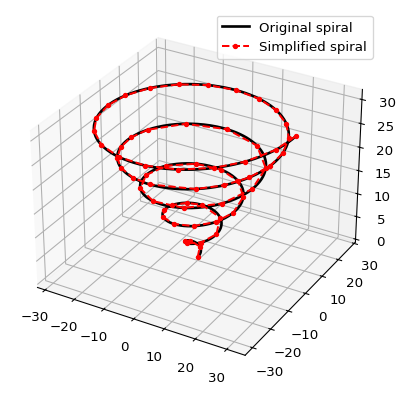

# fastrdp


<a href="https://pypi.org/project/fastrdp/">

</a>

The *fastrdp* package contains an implementation of the
[Ramer–Douglas–Peucker
algorithm](https://en.wikipedia.org/wiki/Ramer%E2%80%93Douglas%E2%80%93Peucker_algorithm)
for reducing the number of points in a curve.

# Example

There are two functions in the *fastrdp* package: `rdp` that returns the
points by the RDP algorithm and `rdp_index` that returns the indices of
the returned points in the input.

Here is a 2D example from the Wikipedia page linked to above with a
description of the algorithm. The original line is black and the
approximating line is red.

``` python
import matplotlib.pyplot as plt
import numpy as np
import fastrdp

x = np.linspace(0, 5, 10_000)
y = np.exp(-x) * np.cos(2 * np.pi * x)
x_new, y_new = fastrdp.rdp(x, y, 0.06)

fig, ax = plt.subplots()
ax.plot(x, y, color='black', linewidth=2.0)
ax.plot(x_new, y_new, linestyle='dashed', color='red')
plt.show()
```


Here is a 3D example of a spiral. The original line is black and the
approximating line is red.

```
import matplotlib.pyplot as plt
import numpy as np
import fastrdp

t = np.linspace(0, 10 * np.pi, 10_000)
x = t * np.cos(t)
y = t * np.sin(t)
z = t

x_new, y_new, z_new = fastrdp.rdp(x, y, z, 1.0)

fig = plt.figure()
ax = fig.add_subplot(111, projection='3d')
ax.plot(x, y, z, color='black', linewidth=2.0)
ax.plot(x_new, y_new, z_new, linestyle='dashed', color='red')

ax.legend()
plt.show()
```



# Performance

Here we compare the performance of *fastrdp* with that of a pure Python
implementation. The example above is executed with *fastrdp* in less
than a millisecond on my machine

``` python
from timeit import timeit
timeit(lambda: fastrdp.rdp(x, y, 0.1), number=10_000)
```

    0.752040293009486

The pure Python implementation in the [*rdp*
package](https://pypi.org/project/rdp) takes longer to execute a single
run than *fastrdp* takes to execute 10.000 runs.

``` python
import rdp
z = np.column_stack((x, y))
timeit(lambda: rdp.rdp(z, epsilon=0.1), number=1)
```

    0.764814316004049

To illustrate how *fastrdp* scales consider the following graph that
shows execution time for an increasing number of random input points.
The figure is produced with the scripts in the `performance` folder.


# Compilation

To specify package metadata *fastrdp* is using the contemporary
`pyproject.toml`. Execute the following commands to build and install
*fastrdp*

``` bash
pip install .
```

If you want an editable installation, then add a `-e` to the last
command. To also install the optional dependencies used for development
add a little extra:

``` bash
pip install -e '.[dev]'
```

The single quotes are needed in zsh, but is perhaps superfluous in other
shells.

# Acknowledgements

Setting up package metadata to build and compile *fastrdp* is inspired
by the [pybind11 example
package](https://github.com/pybind/python_example).
