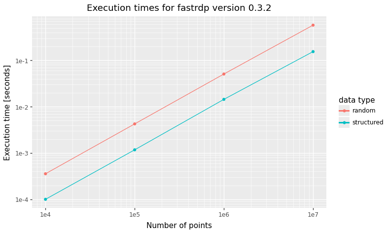

# fastrdp


<a href="https://pypi.org/project/fastrdp/">

</a>

The *fastrdp* package contains an implementation of the
[Ramer–Douglas–Peucker
algorithm](https://en.wikipedia.org/wiki/Ramer%E2%80%93Douglas%E2%80%93Peucker_algorithm)
for reducing the number of points in a curve.

# Examples

The *fastrdp* package offers to compute the points by the RDP algorithm
(`rdp` and `rdpN`) and to compute the which indices in the input should
be returned (`rdp_index`).

## 2D

Here is an example from the Wikipedia page linked to above with a
description of the algorithm. The original line is black and the
approximating line is red.

``` python
import matplotlib.pyplot as plt
import numpy as np
import fastrdp

x = np.linspace(0, 5, 10_000)
y = np.exp(-x) * np.cos(2 * np.pi * x)
x_new, y_new = fastrdp.rdp(x, y, 0.06)

fig, ax = plt.subplots()
ax.plot(x, y, color='black', linewidth=2.0)
ax.plot(x_new, y_new, linestyle='dashed', color='red')
plt.show()
```


## 3D

The `rdp` function handles 2D input. The `rdpN` function handles 2D and
3D input by accepting a numpy matrix instead of two vectors.

``` python
t = np.linspace(0, 10 * np.pi, 1_000)
X = np.column_stack((t * np.cos(t), t * np.sin(t), t))

Z = fastrdp.rdpN(X, 1)

fig = plt.figure()
ax = fig.add_subplot(111, projection='3d')
ax.plot(X[:,0], X[:,1], X[:,2], color='black', linewidth=2.0, label='Original spiral')
ax.plot(Z[:,0], Z[:,1], Z[:,2], '.--', color='red', label='Simplified spiral')
ax.legend()
plt.show()
```


# Performance

Here we compare the performance of *fastrdp* with that of a pure Python
implementation. The example above is executed with *fastrdp* in less
than 0.1 millisecond.

``` python
from timeit import timeit
timeit(lambda: fastrdp.rdp(x, y, 0.1), number=10_000)
```

    0.6885888330289163

The pure Python implementation in the [*rdp*
package](https://pypi.org/project/rdp) takes about the same time to
execute a single run than *fastrdp* takes to execute 10.000 runs.

``` python
import rdp
z = np.column_stack((x, y))
timeit(lambda: rdp.rdp(z, epsilon=0.1), number=1)
```

    0.7545700910268351

To illustrate how *fastrdp* scales consider the following graph that
shows execution time for an increasing number of point for both random
and structured data. “Structured” means that the output of `rdp` is
**much** smaller than the input – the kind of data that the RDP
algorithm is well suited for. The figure is produced with the script
`measure_performance.py` in the `performance` folder.



## C++ performance

In the `performance` folder it is possible to benchmark the C++ code
without the Python overhead. Compile the program (here with clang)

``` bash
clang++ -std=c++20 -Ofast measure_performance.cpp -o measure_performance.out
```

Run the program with `./measure_performance.out`. By default, it
measures the execution time of 10 million random points in 2D.

# Compilation

To specify package metadata *fastrdp* is using the contemporary
`pyproject.toml`. Execute the following commands to build and install
*fastrdp*

``` bash
pip install .
```

If you want an editable installation, then add a `-e` to the last
command. To also install the optional dependencies used for development
add a little extra:

``` bash
pip install -e '.[dev]'
```

The single quotes are needed in zsh, but is perhaps superfluous in other
shells.

# README

This README is made from the [Quarto](https://quarto.org) document
`README.qmd` with this command

``` {bash}
quarto render README.qmd --to gfm --output README.md
```

# Acknowledgements

Setting up package metadata to build and compile *fastrdp* is inspired
by the [pybind11 example
package](https://github.com/pybind/python_example).

Thanks to @max-models for his work on the 3D version.
